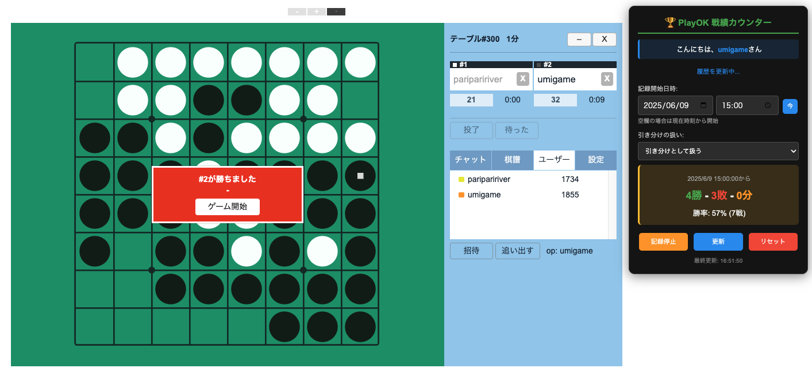

# PlayOK Reversi Total Win Counter

PlayOKのオセロ対戦での累計戦績を追跡するTampermonkey用のユーザースクリプトです。

## スクリーンショット

右上に表示される戦績カウンターで、指定した期間の勝敗数と勝率をリアルタイムで確認できます。  

## 機能

- **戦績追跡**: 指定した開始日時からの勝敗数を自動集計
- **リアルタイム表示**: 現在の勝率・勝敗数をオーバーレイ表示
- **期間指定**: 任意の日時から記録を開始可能
- **データ管理**: 記録の開始/停止、リセット機能

## インストール方法

1. **Tampermonkey拡張機能をインストール**
   - [Chrome Web Store](https://chrome.google.com/webstore/detail/tampermonkey/dhdgffkkebhmkfjojejmpbldmpobfkfo)からTampermonkeyをインストール

2. **スクリプトを追加**
   - `playok-wins-counter.js`の内容をコピー
   - Tampermonkeyダッシュボードを開く
   - 「新しいスクリプトを作成」をクリック
   - コピーした内容を貼り付けて保存

## 使用方法

1. **PlayOKのオセロページにアクセス**
   - `https://www.playok.com/*/reversi*` または統計ページ

2. **カウンターウィジェットが右上に表示**
   - ユーザー名が自動取得される
   - 記録開始日時を設定（空欄の場合は現在時刻）

3. **記録開始**
   - 「記録開始」ボタンをクリック
   - 以降の対戦結果が自動追跡される

4. **機能ボタン**
   - **記録開始/停止**: 追跡の開始・一時停止
   - **更新**: 最新の戦績を手動取得
   - **リセット**: 全ての記録データを削除
   - **今**: 現在時刻を開始日時に設定

## 対応サイト

- `https://www.playok.com/*/reversi*`
- `https://playok.com/*/reversi*`
- `https://www.playok.com/*/stat.phtml*`
- `https://playok.com/*/stat.phtml*`
